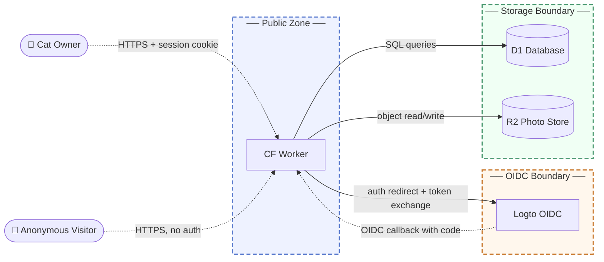

# MishiPass Threat Model

**Aikido scan status:** Retest complete — all findings resolved, clean scan confirmed (2026-07-07).
All three scan surfaces (AI Code Audit, domain, repository) show 0 open issues.
Full evidence report: [mishipass-security-audit-remediation-report.pdf](mishipass-security-audit-remediation-report.pdf)

## 1. Overview

MishiPass is a cat registry and digital health-passport web application running as a Cloudflare Worker. Pet owners register accounts, enroll cats, manage each cat's status (active, missing, adoption, vet-visit), and maintain digital medical records. Unauthenticated third parties interact through public pages: scanning QR codes, submitting sighting reports for missing cats, completing veterinary-visit records on a mode-gated form, and browsing a public recovery board.

Main components:
- Cloudflare Worker: server-rendered web application and REST API, deployed at the edge; handles both public and authenticated routes
- Cloudflare D1: relational database storing owners, sessions, cats, vet records, sighting reports, and transfer requests
- Cloudflare R2: object store for cat profile photos, gallery images, vaccine sticker images, and sighting photos
- Logto OIDC provider: external identity service used for Google and Apple social login
- Resend: external transactional email service for ownership transfer and adoption notifications

This model covers the Worker application, its attached storage, and its external service integrations; Cloudflare platform and infrastructure security are assumed to be provided by the vendor.

## 2. Trust boundaries

- **Public Zone**: Any caller on the internet can reach the Worker. Public routes (cat profiles at `/c/:id`, sighting form, recovery board, vet-visit form) require no credential. Owner-specific routes share the same Worker process but are protected by the session layer. Enforcement for public routes: hashed-IP rate limiting for sighting submissions and public profile lookups; cat-mode gate checks prevent public actions unless the cat's current status permits them. Enforcement for owner routes: the `resolveSession` middleware hashes the raw session cookie value with SHA-256 and validates it against a D1-stored hash with an expiry timestamp; any mismatch or expired record returns 401.

- **OIDC Boundary**: The Worker delegates identity verification for social login to Logto. Enforcement: Authorization Code with PKCE (S256), state and nonce parameters bound to short-lived HttpOnly cookies, RS256 ID-token signature verification against Logto's JWKS endpoint, and issuer, audience, and nonce claim checks before any account is created or linked.

- **Storage Boundary**: Cloudflare D1 and R2 are accessible only from within the Worker runtime via platform bindings. No direct public path to the database or object store exists; the Worker is the sole intermediary.

## 3. Threat scenarios

**Unauthenticated injection of veterinary medical records**
When an owner activates vet-visit mode, the public finish endpoint (`POST /api/cats/:id/vet-visit/finish`) becomes reachable by any caller who knows the cat's public ID. No session or vet credential is checked; the mode gate is the only access control. An attacker who knows the cat's public ID during the active window can permanently write fabricated vaccine records, medication entries, and clinical notes into the cat's health history.
- Risk: Medium likelihood, High impact
- Mitigation: Require a short-lived, single-use vet access token issued by the owner at vet-mode activation, and validate that token on the finish endpoint rather than relying solely on the mode gate.
- Validation: Pentest: confirm the finish endpoint rejects an unauthenticated request for a cat in vet mode when no valid token is supplied.

**Persistent account access after credential change**
Session tokens have a 30-day lifetime with no mechanism to revoke all active sessions when an owner changes their password. An attacker who obtains a valid session token retains full access to the account, including all cat records, sighting data, and ownership transfer controls, for the remainder of that token's lifetime regardless of any subsequent credential change.
- Risk: Medium likelihood, High impact
- Mitigation: Invalidate all D1 session records associated with an owner immediately when their password is changed or when a forced sign-out is requested.
- Validation: Automated test: verify that pre-existing session tokens for an account are rejected by the session middleware immediately after a password update.

**Account takeover through OIDC email auto-linking**
When a user authenticates via Google or Apple for the first time, MishiPass automatically links the social identity to an existing email/password account if the email addresses match, with no confirmation required from the account holder. An attacker who compromises a social provider account that shares an email address with a MishiPass account immediately gains full MishiPass access without ever knowing the MishiPass password.
- Risk: Low likelihood, High impact
- Mitigation: Require explicit owner confirmation (a verification email to the address on file, or password re-entry) before binding a new social identity to an existing email/password account.
- Validation: Pentest: attempt to link a fresh social identity whose email matches an existing account and verify that the binding is not completed without a secondary confirmation step.

**Public sighting endpoint abuse for false-report flooding**
The sighting submission endpoint accepts reports from unauthenticated callers and enforces rate limits using the `CF-Connecting-IP` header. An attacker with sufficient IP diversity or operating in a network configuration where that header is unreliable can submit high volumes of fabricated sighting reports, burying genuine community reports and potentially misdirecting an owner actively searching for a missing cat.
- Risk: High likelihood, Medium impact
- Mitigation: Supplement IP-based rate limiting with a server-issued, time-bound challenge token embedded in the sighting form page load, which the submission endpoint validates before processing any report.
- Validation: Automated test: confirm that a burst of rapid submissions without a valid form token is rejected at the challenge validation layer before reaching the rate-limit check.

## 4. Architectural fragilities

**Vet-visit finish has no authentication backstop**
Medical record writes for a cat in vet mode bypass the session layer entirely by design; the mode-gate check is the sole access control on `POST /api/cats/:id/vet-visit/finish`. This is acknowledged in the source code as a known beta limitation. There is no second control such as a bearer token, a signed challenge, or an audit field tying submitted records to a verified identity. A single mode-state check with no authentication backstop means that during any active vet-visit window, any network-reachable caller who knows the cat's public ID can write permanent records to the medical history. Because the public profile endpoint reveals a cat's current mode, the attack surface becomes observable to any visitor. The lack of a submitter identity on inserted records also means forensic attribution of injected data after the fact is not possible.
